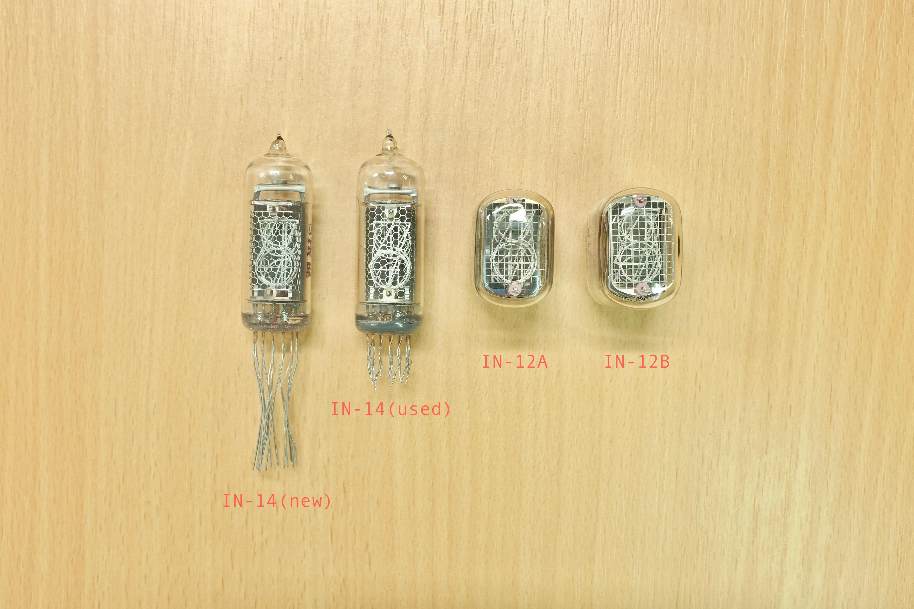

# Buying Nixie tubes

## Choices, choices...

Nixie tubes have been out of production for nearly 30 years. And thanks to the recent revival of Nixie clocks, the price of large tubes has gone through the roof. So if you want your project anywhere near reasonably priced and reliable, there are really only 2 tubes you can choose from, IN-12 or IN-14:

IN-14 is a side-view tube, while IN-12 is front-view. The digits inside are exactly the same, but IN-14 is more expensive thanks to its traditional tube shape. Still, those two mercury-enhanced USSR tubes have excellent reliability and easily last decades when properly driven.

exixe14 is compatible with IN-14 tubes, while exixe12 is for IN-12 tubes:

You can find those tubes on ebay by searching [IN-12 Nixie](https://www.ebay.com/sch/i.html?_from=R40&_nkw=in-12+nixie) or [IN-14 Nixie](https://www.ebay.com/sch/i.html?_from=R40&_nkw=in-14+nixie). Most of the sellers are from Ukraine, and often you have a choice of NOS (new old stock) or used tubes.

## NOS or used?

NOS tubes are brand new and have never been used before. They are more expensive but they are the best bet when it comes to reliability and brightness.

Used tubes are desoldered from old instruments. You don't know how long they have been operating and in what condition. They have shorter pins than new tubes, often have cathode poisoning, sometimes even missing digits or pins.

For IN-14 tubes, I recommend buying NOS if you can afford it. If not, used ones work too but you do need to buy a few more in case of duds.

IN-12 tubes are cheap enough that there are no reason to buy used ones at all. IN-12 has 2 variants. IN-12A has no decimal points, and IN-12B has a left decimal point. Both will work with exixe12 modules. 

## Symbol Tubes

There are a number of special tubes that has symbols inside them instead of numbers, usually for displaying the unit on a measuring equipment. Those tubes are cheaper than usual, but there aren't much you can do with them.

One example is the [IN-19 Nixie tube](http://www.tube-tester.com/sites/nixie/data/IN-19A/in-19a.htm). It is based on IN-14, so you can use it with exixe-14 modules, except all the numbers comes out as symbols instead. You can read more about it on [in-19_pin_mapping.md](in-19_pin_mapping.md)

Another example is [IN-15 Nixie tube](http://www.tube-tester.com/sites/nixie/data/in-15a.htm), which is based on IN-12. It will work with exixe-12 modules.

## Handling Nixie tubes

They are made of glass, and have mercury vapor inside, so don't break them.

Nixie tubes use a tiny amount of power and don't run hot at all, so it's alright to touch the glass while they are running. You can use rubbing alcohol and paper towel to clean the glass, although the alcohol might take the markings off.