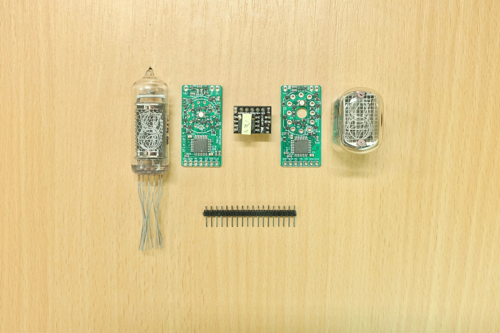
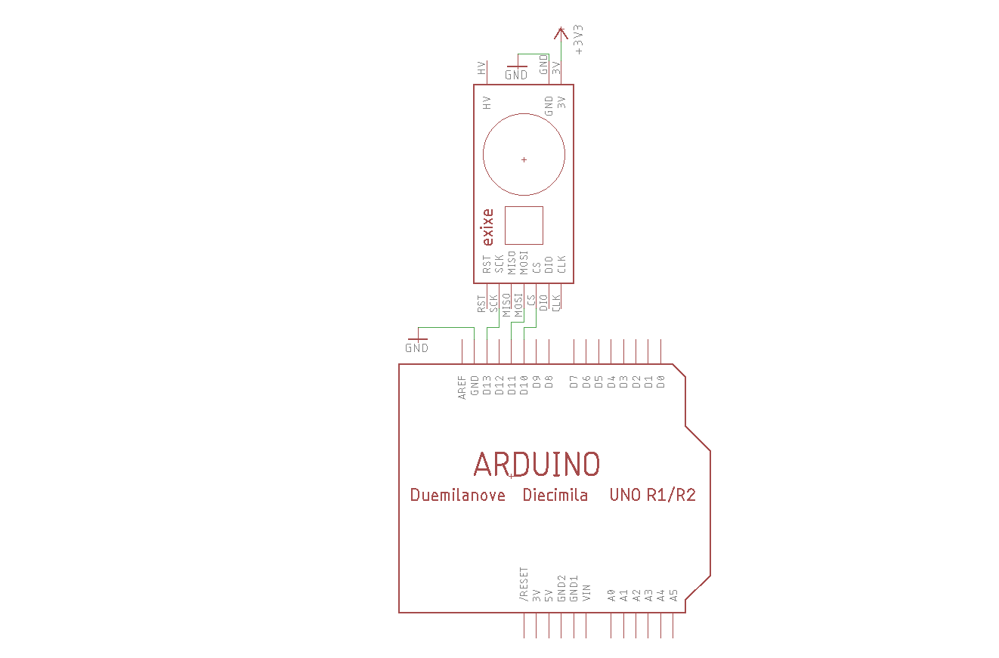
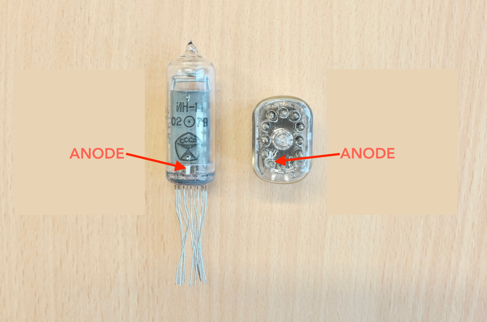
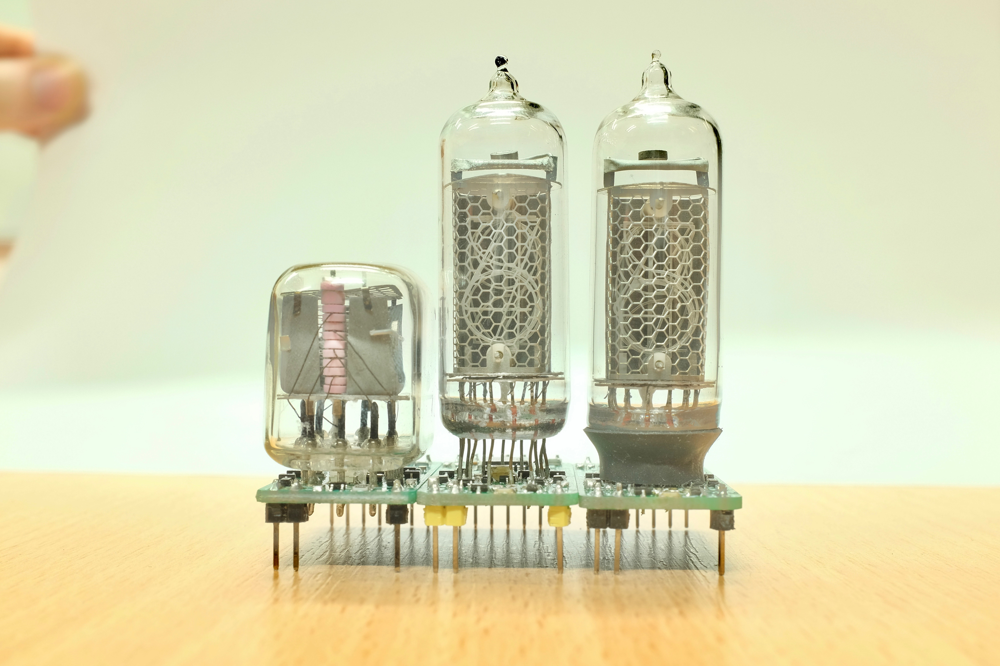
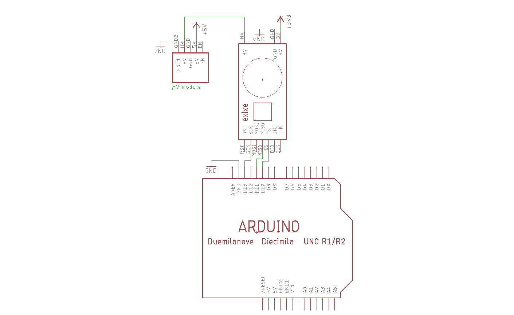

# Getting started with exixe modules

## Prerequisites

You do need a couple of things before we get going, so let's get them out of the way first:

#### Nixie Tubes

[Read this short guide to see what to buy.](buying_nixie_tubes.md)

#### High Voltage Power Supply

Nixie tubes need around 180V to start glowing. That means you need a high voltage supply.

You can design one yourself, although I recommend saving the trouble and getting a premade module [like this one](https://www.ebay.com/itm/DC-5V-12V-to-180V-DC-High-Voltage-NIXIE-Power-Supply-Module-PSU-NIXIE-TUBE-ERA-/322511957768?hash=item4b1735ef08:g:ftQAAOSwYTVZmjZb). They are tiny, inexpensive, efficient, and run on 5V. Just search [5V Nixie power supply](https://www.ebay.com/sch/i.html?_from=R40&_nkw=5V+Nixie+power+supply) on ebay or google. 

## What you should have

By now, you should have the tube, corresponding exixe board, headers, and the high voltage supply:

Good! Now we can get going.

## Installing the Arduino library

Take a look at the [Arduino library docs](arduino_library/README.md) to download and install the library.

If you're not using Arduino, there are some [barebone examples](/arduino_examples/barebone) too.

## Testing the bare module

Let's make sure the board works before hooking up high voltage and installing the tubes.

Solder on the headers, then take a look at the pinout in [technical_details.md](/technical_details.md).

First we hook up the power pins. Connect the GND to GND, and 3.3V power to 3V. 

Next are the SPI lines. Connect MO to MOSI line, SCK to SCK line, and CS to CS line. For Arduino UNO below, MOSI is pin 11, SCK is pin 13, CS is pin 10. Consult the datasheet if you're using other boards.

Then try the [LED test](/arduino_examples/1_LED_test). Change the `cs_pin` variable if you're using a different one. Compile and upload in Arduino IDE. 

The LED on the exixe module should turn purple. You can play around with the RGB values for other colors.

If the board is not responding, take a look at the SPI commands in [technical_details.md](/technical_details.md) to make sure the SPI is configured properly, and the commands are valid. Also make sure the RST pin is HIGH, and CS pin is asserted properly. Use a logic analyzer to see what's going on if you have one.

### Testing tubes

I recommend testing your tubes first to make sure all digits light up, so you don't end up soldering a dud to the module.

First locate the anode on you tube:

On IN-14 the anode pin is on the very back of the tube and is white inside the glass. On IN-12 an arrow on the glass points to the anode pin, which is rather convenient.

Next, connect +5V to 5V input of the high voltage module, and GND to GND. You should get around 180V at the HV output pin. Be very careful not to touch that. It might not kill you but you'll definitely feel a shock.

To test the tube, connect the anode to 180V **THROUGH A 68K RESISTOR**, then touch each cathode with GND and see if the corresponding digit lights up:

Be very careful not to touch exposed metal pins, a pair of glove might help if you want to be sure.

## Solder it on

*If you're using IN-19 tube, please see [this guide](in-19_pin_mapping.md) for more information, otherwise read on.*

After confirming the tube is good, you can insert it to the module. Match anode pin to the anode hole, then line up everything else:

It's a bit tricky on the IN-14 since the pins are not rigid. Just be patient and eventually it will all go in. Again, make sure the anode and every other pin is lined up correctly, then solder the tube in place.

Try keeping the tube straight. For IN-14 leave around 5mm of pins between the PCB and the glass as demonstrated on the middle tube:

It's also a good idea to wrap the bottom of IN-14 tubes with heat-shrink tubing or electric tape like the one on the right, to prevent backlight leaking.

## Power consumption considerations

For the 3.3V power supply, please budget **at least 50mA** for *each* exixe module.

This is especially important if you're using Arduino UNO or other 5V Arduinos. The 3.3V power pin on those can only supply [50mA of current](resources/current.jpg), which is only enough for a single exixe module. If you connect more than one, things start to behave strangely.

You can either switch to a 3.3V Arduino where no such limit exists, or use a [5V to 3.3V regulator](https://www.sparkfun.com/products/526). Don't forget about the input and output capacitors, [they are important](https://electronics.stackexchange.com/questions/232935/why-is-there-always-a-capacitor-on-input-and-output-of-a-voltage-regulator)!

## Try some examples!

After getting the [LED test](/arduino_examples/1_LED_test) working, connect 180V to the HV pin of exixe module, make sure your Arduino, high voltage supply, and exixe module all share the same GND. 

First try the [loop digit](/arduino_examples/2_loop_digit_simple) example, which simply loops through all the digits from 0 to 9:

After that, you can try [crossfade](/arduino_examples/3_loop_digit_crossfade) to see the fancy crossfade animation:

If you're using more than one tube, take a look at [multiple tubes](/arduino_examples/4_multiple_tubes_simple) example:

Note that the multiple modules share the same SCK and MOSI line, only CS line is different.

Finally, the [multiple tubes crossfade](/arduino_examples/5_multiple_tubes_crossfade) example:

## Resources

Consult the [Arduino library docs](arduino_library/README.md) and [Python library docs](python_library/README.md) to see how to use library functions. And explore the [arduino sample sketches](/arduino_examples) and [python samples](/python_examples).

If you want to keep it simple, there are some self-contained [barebone examples](/arduino_examples/barebone) too.

## Go and have fun!

If you have any questions, feel free to [open an issue](https://github.com/dekuNukem/exixe/issues) or email me at `dekunukem gmail com`. The former is preferable since it helps other people too.

That's pretty much it! You can let your imagination run free now. Go wild and have fun!
