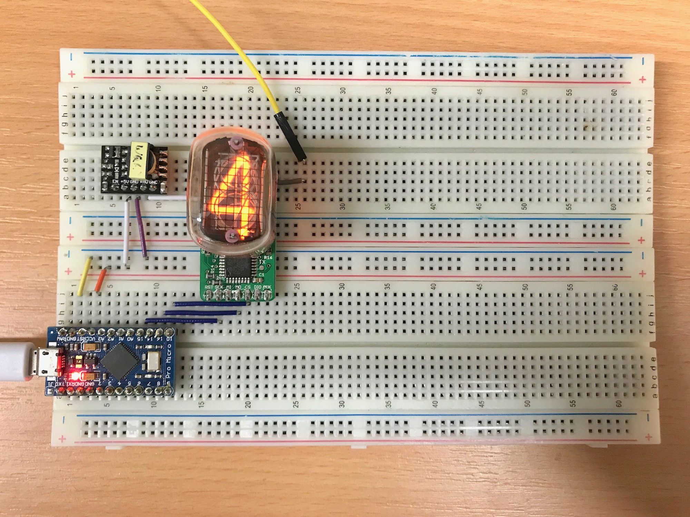

## Getting started

Since I have already sold a few exixe modules, here is a short introduction on how to get started with exixe modules:

### Wiring it up

You should first wire it up and test to see if the board is working before soldering on the nixie tubes.

First take a look at the pinout in [technical_details.md](/technical_details.md), connect the GND to GND, and 3.3V power to 3V3. If you turn it on at this stage the LED should be faintly on, and nothing else should happen.

Then let's connect the SPI lines. Connect MO on the to MOSI line, SCK to SCK line, and CS to CS line. For Arduino Uno, MOSI is pin 11, SCK is pin 13, CS is pin 10. Consult the pinout page if you're using other boards.

MISO is not used so you can leave it off. Leave HV pin unconnected for now as well. 

If you are unfamiliar with SPI, or need a refresher, [sparkfun's introduction](https://learn.sparkfun.com/tutorials/serial-peripheral-interface-spi) is really helpful, and [the wikipedia page](https://en.wikipedia.org/wiki/Serial_Peripheral_Interface_Bus) has more details.

Now you can go through the [provided Arduino examples](/arduino_examples). Try the [LED test](/arduino_examples/0_LED_test) first. Compile and upload the sketch, the LED on the exixe module should turn purple. You can play around with the RGB values in the sketch to change it to other colors.

Once you're happy with the LED, you can try hooking up a Nixie tube to the module. Always test your tubes first before soldering them to the module. You can do that by connecting the anode to +180V through a 68K resistor and touch each cathode with GND and see if the corresponding digit lights up.

### High voltage supply and tube testing

I suggest buying a premade miniature high voltage power supply to Nixie tubes like [this one](https://www.ebay.com/itm/DC-5V-12V-to-170V-DC-High-Voltage-NIXIE-Power-Supply-Module-PSU-NIXIE-TUBE-ERA-/322511957768?hash=item4b1735ef08:g:ftQAAOSwYTVZmjZb), they are not that expensive, pretty efficient, runs on 5V, and saves tons of trouble of designing one yourself. Just search "5V nixie power supply" on ebay. 

Needless to say the high voltage needed to drive Nixie tubes is dangerous. Those high voltage modules above probably won't generate enough current to kill you, but you do feel a tingle if your finger is dry, and a rather nasty shock if it's damp, so do watch out where you put your fingers.

After you're sure the tube is good, you can solder it to the module. Look at the pinout in [technical_details.md](/technical_details.md), and double check the pins are in the right hole, the anode pin should be in the anode hole, and the rest of them lined up properly.

### Example Sketches

Once after that's done, connect the 180V output of the supply to the HV pin of exixe module, make sure your Arduino, high voltage supply, and exixe module all share the same GND, and try the [show_digit4](/arduino_examples/1_show_digit4) and [show_all_digits](/arduino_examples/2_show_all_digits) example next.

The first one just shows the digit 4:

And the second one loops through all the digits from 0 to 9:

That's pretty much it! You can let your imagination run free now. You can probably adopt the functions in [show_all_digits](/arduino_examples/2_show_all_digits) for more complex display routines, or write some fancy crossfade transition animations like [here](https://www.youtube.com/watch?v=r3d2alzgjKc). And if you're not using Arduino, the code is simple enough to adept to other embedded systems, it's just plain C after all.