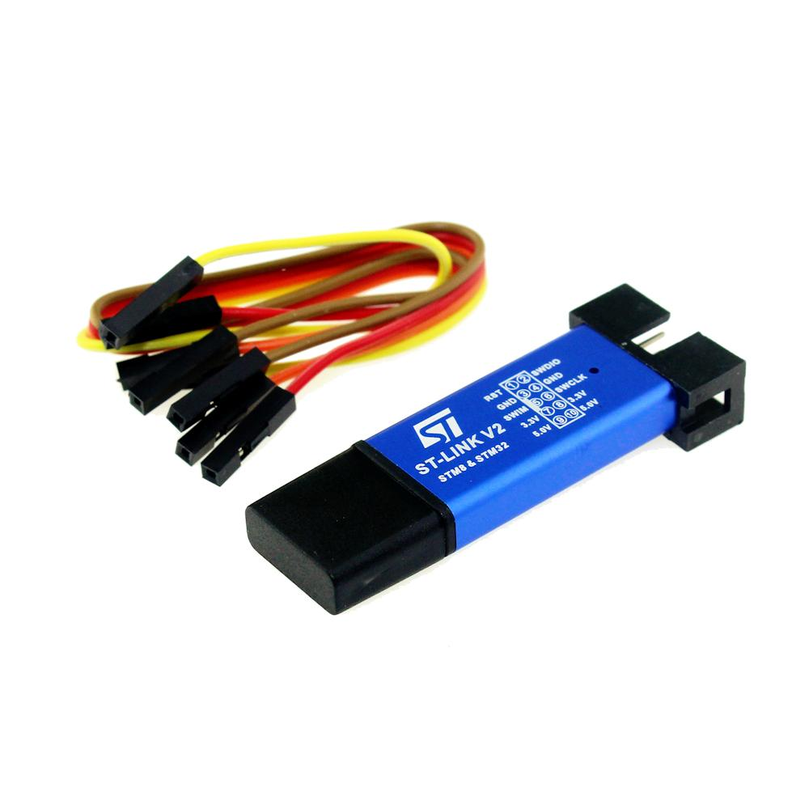
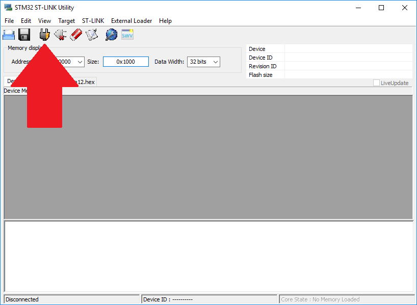
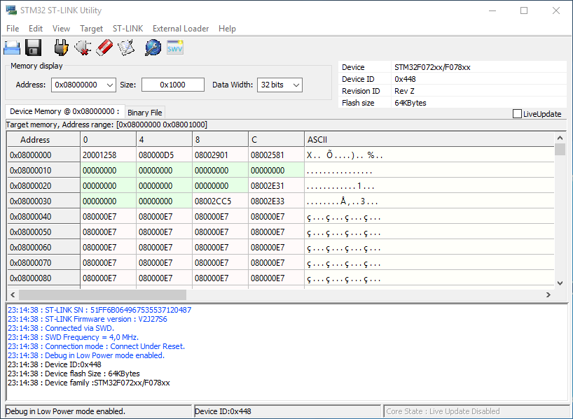
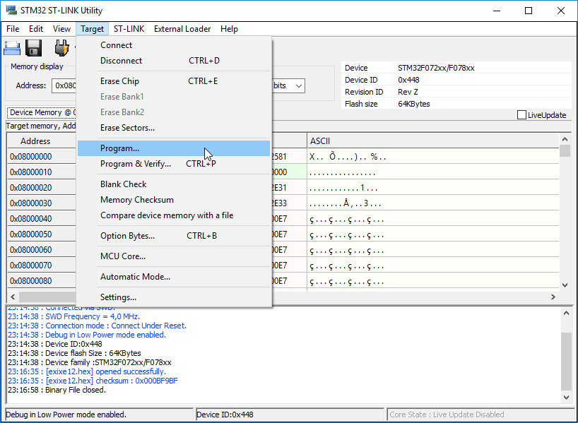
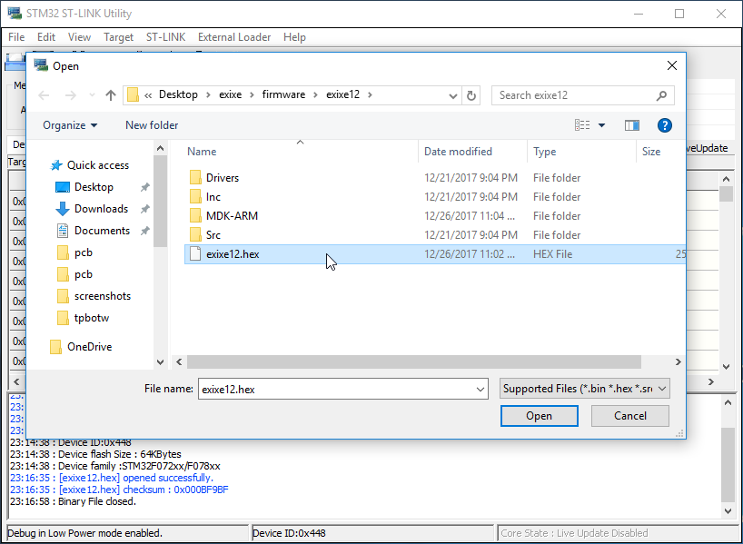
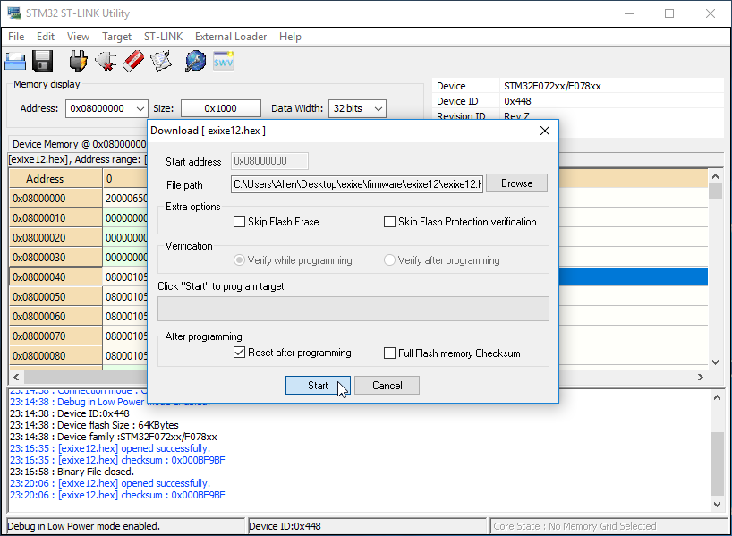

# Making some yourself

Making some exixe modules yourself is fairly straightforward, just order the PCBs and parts and solder them together. Since the component count is not small and they are densely populated, I suggest order the PCB in panels of 6 or 8 and get a matching stencil to apply the paste. Use of reflow oven or skillet reflow is also recommended, since soldering each and every component by hand is basically torture.

Full BOM here: [exixe12](resources/exixe12_bom.xlsx), [exixe14](resources/exixe14_bom.xlsx)

* The NPN transistor used on every cathode is [BF820](https://www.mouser.co.uk/Search/ProductDetail.aspx?R=BF820W%2c135virtualkey66800000virtualkey771-BF820W135)
* The single PNP transistor used in overdrive circuit is [MSB92](https://www.mouser.co.uk/Search/ProductDetail.aspx?R=MSB92ASWT1Gvirtualkey58410000virtualkey863-MSB92ASWT1G)
* Microcontroller is [STM32F042K6T6](https://www.mouser.co.uk/Search/ProductDetail.aspx?R=STM32F042K6T6virtualkey51120000virtualkey511-STM32F042K6T6)
* LED is [Wurth Electronics 150141M173100](https://www.mouser.co.uk/Search/ProductDetail.aspx?R=150141M173100virtualkey51100000virtualkey710-150141M173100)

## Upload Firmware

Once you have soldered the board together, you will need to upload the firmware to the STM32 microcontroller in order for the boards to function.

To do that you need a ST-Link V2 programmer. Just search "ST-Link V2" on ebay, they are dirt cheap (around $3). It should look like this:

Then go and download the free STM32 ST-LINK Utility from the official ST website:

http://www.st.com/en/development-tools/stsw-link004.html

Click "get software" at the bottom of the page, then provide a name and email to get the download link. Use a fake name and a burner email like [this one](https://slippery.email/) to avoid spams.

The ST-LINK Utility will install the driver for the programmer automatically. After which you can connect the programmer to the exixe board:

* `GND` to `GND`
* `3.3V` to `3V`
* `SWDIO` to `DIO`
* `SWCLK` to `CLK`

After the board is connected to the programmer, plug the programmer into the USB port, then open the ST-LINK Utility. Click the button indicated below to connect to the microcontroller:

If your solder job is good, the ST-LINK Utility should be able to connect to the STM32 and show the content of its internal memory:

If the chip is brand new, everything shoud be 0xff. Anyway, click Target -> Program:

Then select the HEX file that you want to use, [exixe12](/firmware/exixe12/exixe12.hex) [exixe14](/firmware/exixe12/exixe14.hex):

Then click start to upload the firmware:

That's pretty much it if you don't want to recompile the firmware. If you do however you'll need to download the [Keil MDK](https://www.keil.com/demo/eval/arm.htm), it's slightly more involved, [see this guide](https://github.com/dekuNukem/STM32_tutorials) for details.