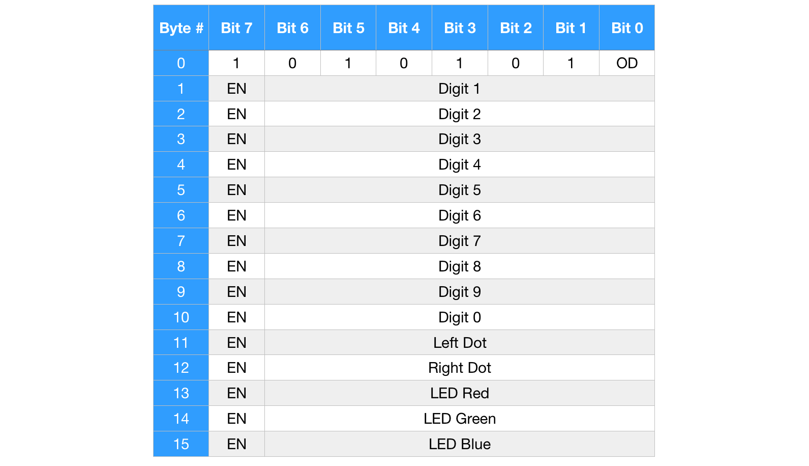
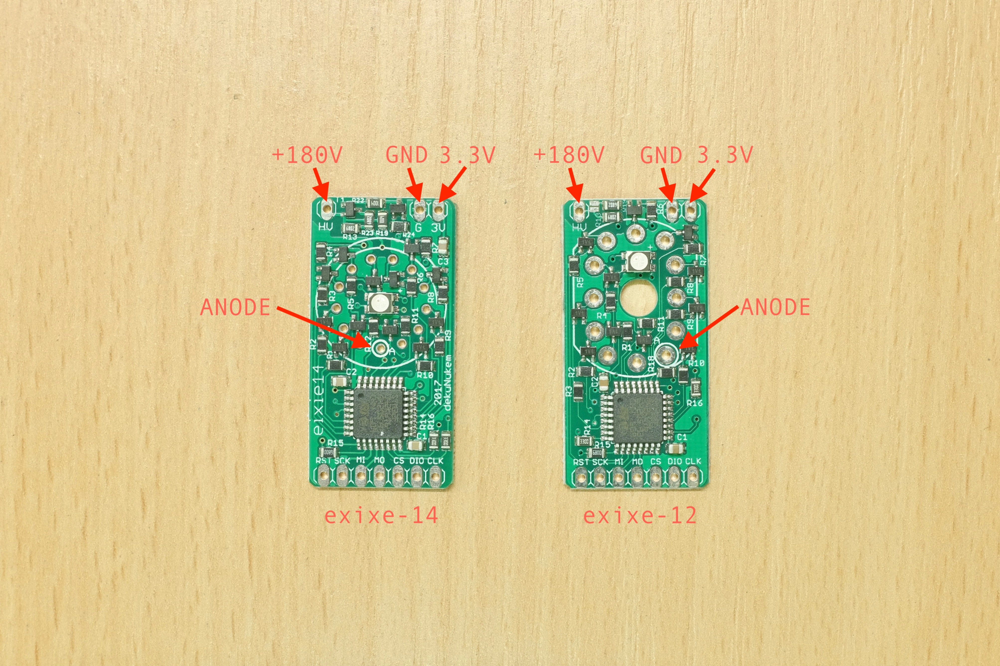
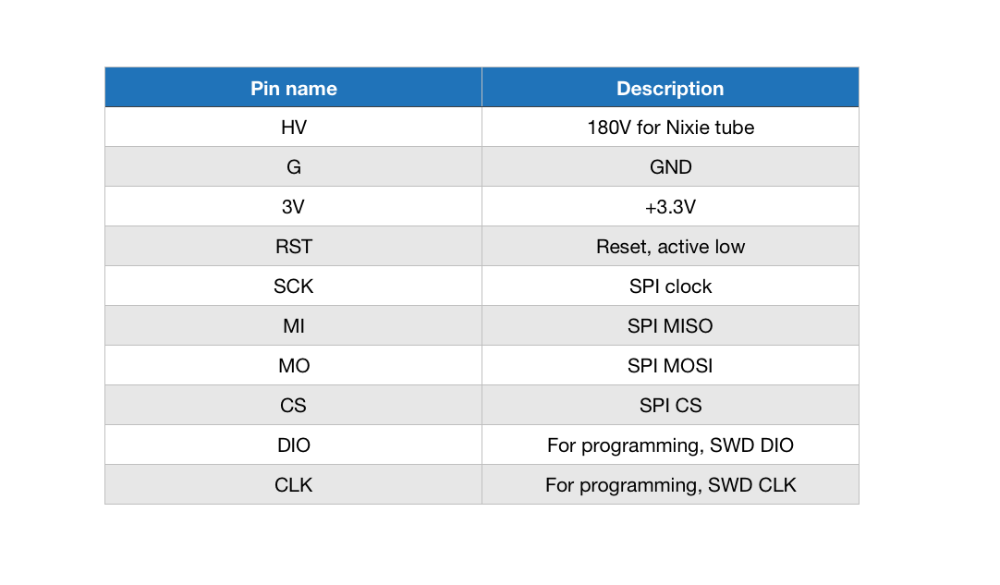

## SPI command protocol

### SPI configurations

* MSB first
* 8 bits per transfer
* Clock is LOW when inactive (CPOL = 0)
* MOSI data valid on clock rising edge (CPHA = 0)
* Enable is active LOW
* Max clock rate 24MHz (according to datasheet, I only tested up to 8MHz)

### SPI data format

exixe expects a fixed 16-byte command, which should be sent within one CS activation (CS down, send 16 bytes, CS up):

* Byte 0 is sent first, byte 15 sent last.

* Set OD to 0 for regular current(2.6mA), 1 to enable tube overdrive (5.3mA)

* Set EN to 1 for the following value to take effect, 0 for no change.

* Brightness values are 7-bit integer from 0 to 127, 0 being off and 127 being brightest.

* SPI commands are the same for exixe-12 and exixe-14, however OD and right dot are not available on exixe-12, changing them will have no effect.

### Notes

* Only one single digit should be on at any given time, apart from during transition animations.
* Dots can be turned on alongside digits.

### Sample timing capture

Setting digit 4 to fully on while other digits are off, no overdrive, orange LED color:

Detailed timing for the first byte:

## Board pinout

* Pinout and dimension are the same for exixe-12 and exixe-14.
* Officially, exixe modules are NOT 5V compatible, all signals are 3.3V level.
* However it does seem to work with 5V Arduinos with no short term damage. Anyway, I suggest using 3.3V Arduinos, or put a 4.7K resistor in series to limit current.
* Still, the module itself must be powered at 3.3V.
* When assembling insert the Nixie tube so its anode lead is in the anode hole, and TEST THE TUBE BEFORE SOLDERING it in place.

## Technical details

At the heart of the module is a STM32F042K6T6 microcontroller, which is connected to the cathodes of the Nixie tube through high-voltage transistors to turn them on or off. Thanks to the abundance of timers, every single cathode gets their own hardware PWM, which is much more consistent and smooth than software toggling.

The PWM frequency is 200Hz by default, it works well and can be changed by adjusting timer predivider values.

The microcontroller acts as a SPI slave and reads 16-byte commands from the master devices. Details of which can be found on the section above.

In normal operation each cathode has a 68K current resistor, allowing 2.6mA at 180V. However, if you're using IN-14 tubes chances are they are second-hand, and most I see doesn't light up all the way on digit 2 and 3. They are slightly poisoned and needs a bit more current to light up properly. Therefore exixe-14 features an overdrive command that allows twice that current to pass through.

Please note that you still need a high-voltage power supply around 180V for Nixie tubes to start glowing. You can design one yourself for your project, or use a pre-made module that takes 5V and outputs 180V. Just search "5V nixie power" on ebay, here's [one example](https://www.ebay.com/itm/DC-5V-12V-to-170V-DC-High-Voltage-NIXIE-Power-Supply-Module-PSU-NIXIE-TUBE-ERA-/322511957768?hash=item4b1735ef08:g:ftQAAOSwYTVZmjZb).
